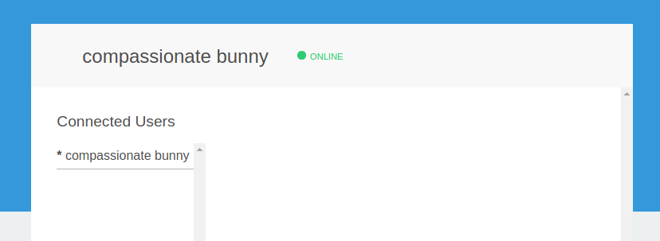
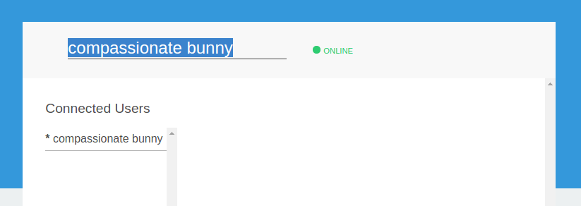
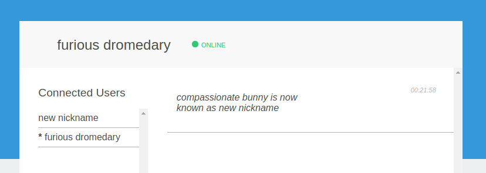

# Angular Chat

This project is an angular application, written using [Typescript](http://www.typescriptlang.org/) version 2.0.0,
and [Angular CLI](https://github.com/angular/angular-cli) version 1.0.0-beta.32.3.


## Running the application

The application requires the [websocket sever](https://github.com/1M0reBug/angular-chat-server) to be running, otherwise, it will fail to start.
You may refer to the server Readme to know how to launch it (`npm start`).

The best way to run the application is to use the files in the `dist/` folder.
To run a python server under Unix systems it is possible to use the following command:

```shell
$ cd dist
$ python -m SimpleHTTPServer
Serving HTTP on 0.0.0.0 port 8000 ...
```

Then it is possible to navigate to [localhost:8000](http://localhost:8000) and see the
application running.

When the app launches, the user is given a random nick name. This username is displayed at the top
left corner



It is possible to change the username by clicking on this username. An editing field
will appear, giving the possibility to update the username.



When submited the new username is broadcasted to everyone displaying an update message
and updating the list of connected users.



## Dependencies (if needed)

In order to install the ng-cli you can visit the official documentation.

```shell
$ npm install --global @angular/cli
```

## Roadmap

- [x] There is a single chat room
- [x] All connected users are visible in the room
- [x] All users get auto-generated user names when they connect
- [x] A user should be able to change their name
- [x] All users can send and read messages


## Development server
Run `ng serve` for a dev server. Navigate to `http://localhost:4200/`. The app will automatically reload if you change any of the source files.

## Build

Run `ng build` to build the project. The build artifacts will be stored in the `dist/` directory. Use the `-prod` flag for a production build.

